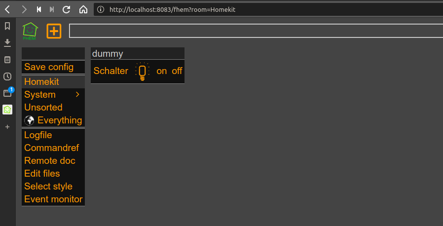
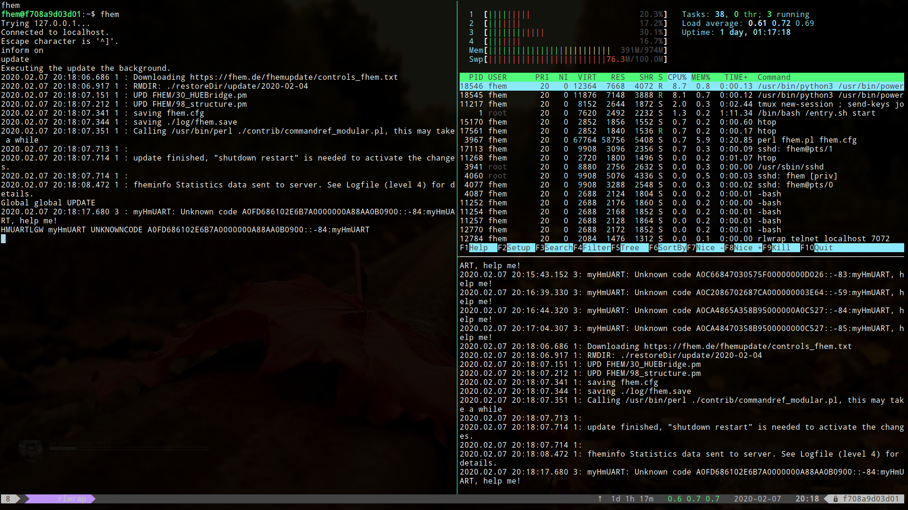
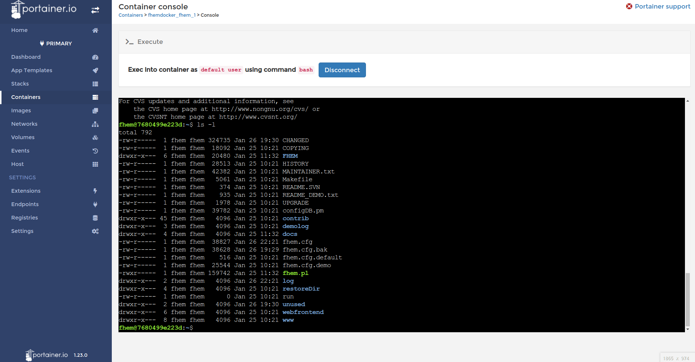
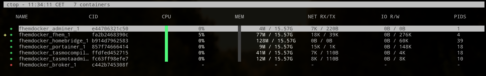

# Home Automation Stack

The stack contains everything to run FHEM on a Docker host. Mosquitto is used as message broker. SIRI functions are realized with the help of a homebridge container. The complete stack runs on x86 as well as arm architectures. It is very easy to clone its complete productive environment and has a simple way to build a test system.

## Todo

+ [ ] Mosquitto user-/groupid problem
+ [ ] Grafana integration

## Table of content

<!-- vim-markdown-toc GitLab -->

    * [Requirements](#requirements)
    * [Installation raspberrypi](#installation-raspberrypi)
        * [Raspian Download](#raspian-download)
        * [System Update](#system-update)
        * [Set timezone](#set-timezone)
        * [Raspberry Config](#raspberry-config)
        * [Disable swap](#disable-swap)
        * [Intall additional packages](#intall-additional-packages)
        * [Configure ntpd daemon](#configure-ntpd-daemon)
        * [Install oh-my-zsh](#install-oh-my-zsh)
        * [Install log2ram (/var/log 2 ram)](#install-log2ram-varlog-2-ram)
        * [Setup ssh key for user](#setup-ssh-key-for-user)
        * [Install docker & docker-compose](#install-docker-docker-compose)
        * [git repository export and start all container](#git-repository-export-and-start-all-container)
        * [Access the application](#access-the-application)
            * [FHEM](#fhem)
            * [influxdb](#influxdb)
    * [Container](#container)
        * [Tasmota Admin](#tasmota-admin)
        * [Tasmota Compiler](#tasmota-compiler)
        * [Homebridge](#homebridge)
        * [Portainer](#portainer)
        * [Deconz](#deconz)
    * [Configuring Raspbian for RaspBee](#configuring-raspbian-for-raspbee)
        * [Watchtower](#watchtower)
    * [ctop](#ctop)
        * [Description](#description)
        * [Installation](#installation)
        * [Installation Linux](#installation-linux)
            * [x86 Platform](#x86-platform)
            * [arm Platform](#arm-platform)
    * [Known Issues](#known-issues)
        * [FHEM website not reachable](#fhem-website-not-reachable)
    * [Contributing to fhemdocker](#contributing-to-fhemdocker)
    * [Accessing the docker container via remote](#accessing-the-docker-container-via-remote)
* [End](#end)

<!-- vim-markdown-toc -->

## Requirements

+ docker
+ docker-compose

## Installation raspberrypi

### Raspian Download

Download the image of your choise: [Raspian Download](https://www.raspberrypi.org/software/operating-systems/)
Unzip the image and install it with:

      sudo dd bs=4M if=2021-10-30-raspios-bullseye-armhf-lite.img of=/dev/mmcblk0 conv=fsync
      sync

Eject the card and insert it again to mount the filesystems boot & rootfs.
Touch a blank file ssh to enable sshd daemon on first boot.

      sudo touch /media/boot/ssh
      sync
      umount /media/boot
      umount /medua/rootfs

Eject the card and insert into your raspberrpi. After that power on the rpi and login with
the known user __pi__ and password __raspberry__.

      ssh pi@raspberrypi4

Change your password with the command

      pi@raspberrypi:~ $ passwd
      Changing password for pi.
      Current password:
      New password:
      Retype new password:
      passwd: password updated successfully
      pi@raspberrypi:~ $

### System Update

      sudo apt-get update
      sudo apt-get dist-upgrade

### Set timezone

      sudo dpkg-reconfigure tzdata

### Raspberry Config

1) Expand the root filesystem (A1 / Advanced Options)
2) Update raspi-config

      sudo raspi-config
      sudo reboot

### Disable swap

      sudo dphys-swapfile swapoff && \
      sudo dphys-swapfile uninstall && \
      sudo systemctl disable dphys-swapfile

### Intall additional packages

      sudo apt-get install wget git apt-transport-https vim telnet zsh zsh-autosuggestions zsh-syntax-highlighting ntp ksh logwatch

### Configure ntpd daemon

      sudo vi /etc/ntp.conf

Disable all pool server and add your local time server

      server 192.168.1.1

### Install oh-my-zsh

      sh -c "$(curl -fsSL https://raw.github.com/ohmyzsh/ohmyzsh/master/tools/install.sh)"

### Install log2ram (/var/log 2 ram)

[github page log2ram](https://github.com/azlux/log2ram "Github link")

      echo "deb http://packages.azlux.fr/debian/ buster main" | sudo tee /etc/apt/sources.list.d/azlux.list
      wget -qO - https://azlux.fr/repo.gpg.key | sudo apt-key add -
      apt update
      apt install log2ram

### Setup ssh key for user
      ssh-keygen -t rsa -b 8192

### Install docker & docker-compose

After installation put your user pi into the docker group.

      #curl -sSL https://get.docker.com | sh
      #sudo systemctl enable docker
      #sudo systemctl start docker
      sudo apt-get install docker docker-compose
      sudo usermod -aG docker pi
      sudo reboot

### git repository export and start all container

Note: Please run the startup.sh script after cloning.

      cd
      git clone https://github.com/stormmurdoc/fhemdocker.git
      cd fhemdocker
      ./startup.sh

### Access the application

#### FHEM

FHEM tmux session inside the container

http://localhost:80

#### influxdb

Further details about the influxdb module can be found here.
[FHEM Wiki influxdb](https://wiki.fhem.de/wiki/InfluxDBLogger)

## Container

### Tasmota Admin

[http://localhost:8081](http://localhost:8080 "Weblink Tasmota Admin")

### Tasmota Compiler

[http://localhost:8082](http://localhost:8082 "Weblink Tasmota Compiler")

### Homebridge

Default User: admin
Default Passwort: admin

[http://localhost:8080](http://localhost:8080 "Weblink Homebridge")

### Portainer

[http://localhost:9000](http://localhost:9000 "Weblink Portainer")

### Deconz

[deCONZ Image](https://hub.docker.com/r/marthoc/deconz/) Container Integration

## Configuring Raspbian for RaspBee

Raspbian defaults Bluetooth to /dev/ttyAMA0 and configures a login shell over serial (tty). You must disable the tty login shell and enable the serial port hardware, and swap Bluetooth to /dev/S0, to allow RaspBee to work properly under Docker.

To disable the login shell over serial and enable the serial port hardware:

1) sudo raspi-config
1) Select Interfacing Options
1) Select Serial
1) “Would you like a login shell to be accessible over serial?” Select No
1) “Would you like the serial port hardware to be enabled?” Select Yes
1) Exit raspi-config and reboot
To swap Bluetooth to /dev/S0 (moving RaspBee to /dev/ttyAMA0), run the following command and then reboot:

`echo 'dtoverlay=miniuart-bt' | sudo tee -a /boot/config.txt`

This will exchange the UART and the Mini-UART so the Mini-UART is connected to the bluetooth and the UART to the GPIO pins.

On Raspberry Pi 4 verify that file /boot/config.txt does NOT contain a line "enable_uart=0". If the line exists remove or comment (#) this line.

After running the above command and rebooting, RaspBee should be available at /dev/ttyAMA0.

### Watchtower

This container automatically update all running container within a given time interval.

[https://containrrr.github.io/watchtower/](https://containrrr.github.io/watchtower/ "Homepage Watchtower")

## ctop

### Description

ctop is a commandline monitoring tool for linux containers

### Installation

ctop is available in [AUR](https://aur.archlinux.org/packages/ctop/), so you can install it using AUR helpers, such as YaY, in Arch Linux and its variants such as Antergos and Manjaro Linux.

### Installation Linux

#### x86 Platform
      sudo wget https://github.com/bcicen/ctop/releases/download/v0.7.5/ctop-0.7.5-linux-amd64 -O /usr/local/bin/ctop
      sudo chmod +x /usr/local/bin/ctop

#### arm Platform
      sudo wget https://github.com/bcicen/ctop/releases/download/v0.7.5/ctop-0.7.5-linux-arm -O /usr/local/bin/ctop
      sudo chmod +x /usr/local/bin/ctop

## Known Issues

### FHEM website not reachable

["Error nginx"](./.media/nginx_error.png "nginx error screenshot")

If you're not able to login. Please check the permissons of the .htpasswd file in

      ./fhemdocker/reverseproxy/config/.htpasswd

Set the right to 644 with

      chmod 644 ./fhemdocker/reverseproxy/config/.htpasswd

## Contributing to fhemdocker
Contributions are encouraged and welcome!

## Accessing the docker container via remote

If you want to commit a FHEM command via the local telnet daemon you can use the script fcmd.sh.
Note: Please change the hostname accordingly.

      Username: pi
      Hostname: raspberrypi4 (replace it with your hostname)

      fcmd.sh <FHEM Command>

# End
