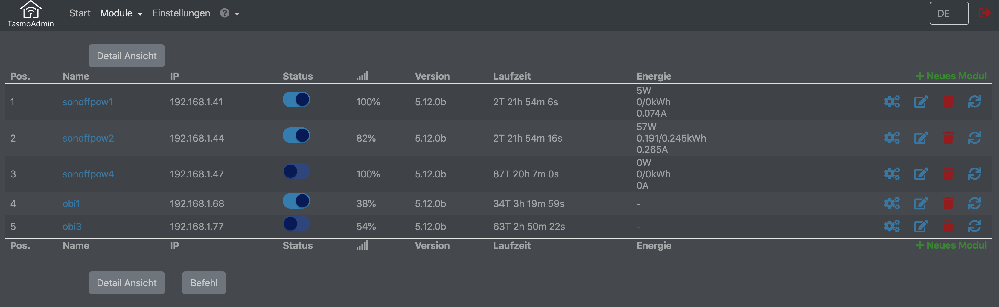
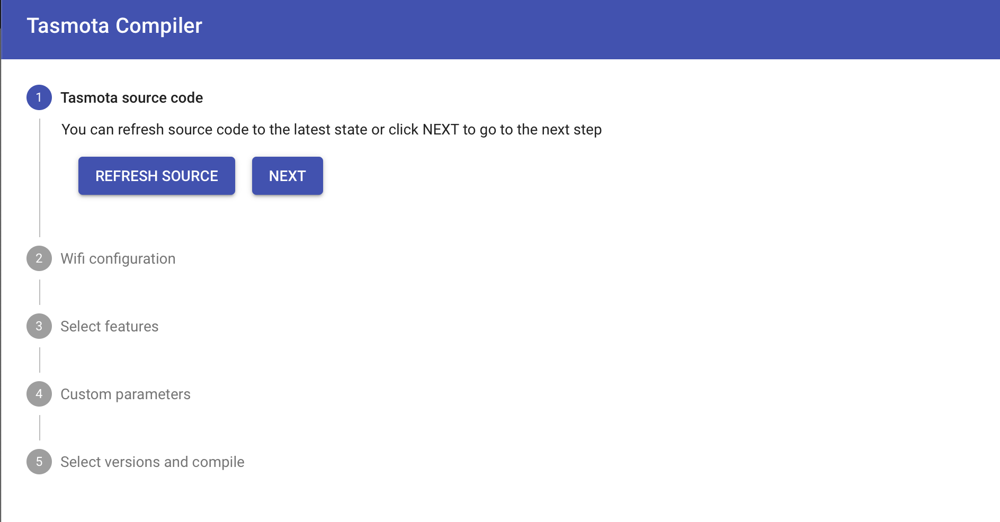
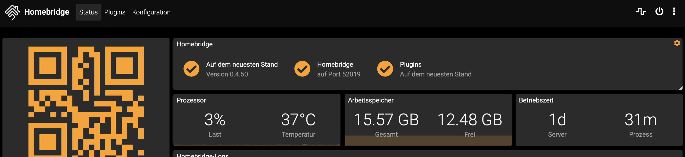

# Home Automation Stack

The stack contains everything to run FHEM on a Docker host. Mosquitto is used as message broker. SIRI functions are realized with the help of a homebridge container. The complete stack runs on x86 as well as arm architectures. It is very easy to clone its complete productive environment and has a simple way to build a test system.

## Todo

+ DBLog Integration
+ Boot config Raspberrypi for Homematic modul

define myHmUART HMUARTLGGW /dev/ttyAMA0

## Requirements

+ docker
+ docker-compose

## Installation raspberrypi

### Raspian Download

Download the image of your choise: [Raspian Download](https://www.raspberrypi.org/downloads/raspbian/)
Unzip the image and install it with:

      sudo dd bs=4M if=2019-09-26-raspbian-buster-full.img of=/dev/mmcblk0 conv=fsync
      sync

Eject the card and insert it again to mount the filesystems boot & rootfs.
Touch a blank file ssh to enable sshd daemon on first boot.

      sudo touch /media/boot/ssh
      sync
      umount /media/boot
      umount /medua/rootfs

Eject the card and insert into your raspberrpi. After that power on the rpi and login with
the known user __pi__ and password __raspberry__.

      ssh pi@raspberrypi4

Change your password with the command

      pi@raspberrypi:~ $ passwd
      Changing password for pi.
      Current password:
      New password:
      Retype new password:
      passwd: password updated successfully
      pi@raspberrypi:~ $

### System Update

      sudo apt-get update
      sudo apt-get dist-upgrade

### Set timezone

      sudo dpkg-reconfigure tzdata

### Raspberry Config

1) Expand the root filesystem (A1 / Advanced Options)
2) Update raspi-config

      sudo raspi-config
      sudo reboot

### Intall additional packages

      sudo apt-get install wget git apt-transport-https vim telnet zsh zsh-autosuggestions zsh-syntax-highlighting

### Install oh-my-zsh

      sh -c "$(curl -fsSL https://raw.github.com/ohmyzsh/ohmyzsh/master/tools/install.sh)"

### Install log2ram (/var/log 2 ram)

[github page log2ram](https://github.com/azlux/log2ram "Github link")

      echo "deb http://packages.azlux.fr/debian/ buster main" | sudo tee /etc/apt/sources.list.d/azlux.list
      wget -qO - https://azlux.fr/repo.gpg.key | sudo apt-key add -
      apt update
      apt install log2ram

### Setup ssh key for user
      ssh-keygen -t rsa -b 8192

### Install .ssh/config file to ignore strictHostKeyChecking

      vi ~/.ssh/config

      Host fhemlocalhost
      Hostname localhost
      Port 222
      User fhem
      StrictHostKeyChecking no

### Install docker & docker-compose

After installation put your user pi into the docker group.

      #curl -sSL https://get.docker.com | sh
      #sudo systemctl enable docker
      #sudo systemctl start docker
      sudo apt-get install docker docker-compose
      sudo usermod -aG docker pi
      sudo reboot

### git repository export and start all container

      cd
      git clone https://github.com/stormmurdoc/fhemdocker.git
      cd fhemdocker
      docker-compose up

### Access the application

#### FHEM

FHEM tmux session inside the container

http://localhost:80

## Container

### Tasmota Admin

[http://localhost:8081](http://localhost:8080 "Weblink Tasmota Admin")

### Tasmota Compiler

[http://localhost:8082](http://localhost:8082 "Weblink Tasmota Compiler")

### Homebridge

[http://localhost:8080](http://localhost:8080 "Weblink Homebridge")

### Portainer

[http://localhost:9000](http://localhost:9000 "Weblink Portainer")

### Deconz

[deCONZ Image](https://hub.docker.com/r/marthoc/deconz/) Container Integration

## Configuring Raspbian for RaspBee

Raspbian defaults Bluetooth to /dev/ttyAMA0 and configures a login shell over serial (tty). You must disable the tty login shell and enable the serial port hardware, and swap Bluetooth to /dev/S0, to allow RaspBee to work properly under Docker.

To disable the login shell over serial and enable the serial port hardware:

1) sudo raspi-config
1) Select Interfacing Options
1) Select Serial
1) “Would you like a login shell to be accessible over serial?” Select No
1) “Would you like the serial port hardware to be enabled?” Select Yes
1) Exit raspi-config and reboot
To swap Bluetooth to /dev/S0 (moving RaspBee to /dev/ttyAMA0), run the following command and then reboot:

`echo 'dtoverlay=miniuart-bt' | sudo tee -a /boot/config.txt`

This will exchange the UART and the Mini-UART so the Mini-UART is connected to the bluetooth and the UART to the GPIO pins.

On Raspberry Pi 4 verify that file /boot/config.txt does NOT contain a line "enable_uart=0". If the line exists remove or comment (#) this line.

After running the above command and rebooting, RaspBee should be available at /dev/ttyAMA0.

## ctop

### Description

ctop is a commandline monitoring tool for linux containers

### Installation

ctop is available in [AUR](https://aur.archlinux.org/packages/ctop/), so you can install it using AUR helpers, such as YaY, in Arch Linux and its variants such as Antergos and Manjaro Linux.

### Installation Linux

#### x86 Platform
      sudo wget https://github.com/bcicen/ctop/releases/download/v0.7.3/ctop-0.7.3-linux-amd64 -O /usr/local/bin/ctop
      sudo chmod +x /usr/local/bin/ctop

#### arm Platform
      sudo wget https://github.com/bcicen/ctop/releases/download/v0.7.3/ctop-0.7.3-linux-arm -O /usr/local/bin/ctop
      sudo chmod +x /usr/local/bin/ctop

## Contributing to fhemdocker
Contributions are encouraged and welcome!

